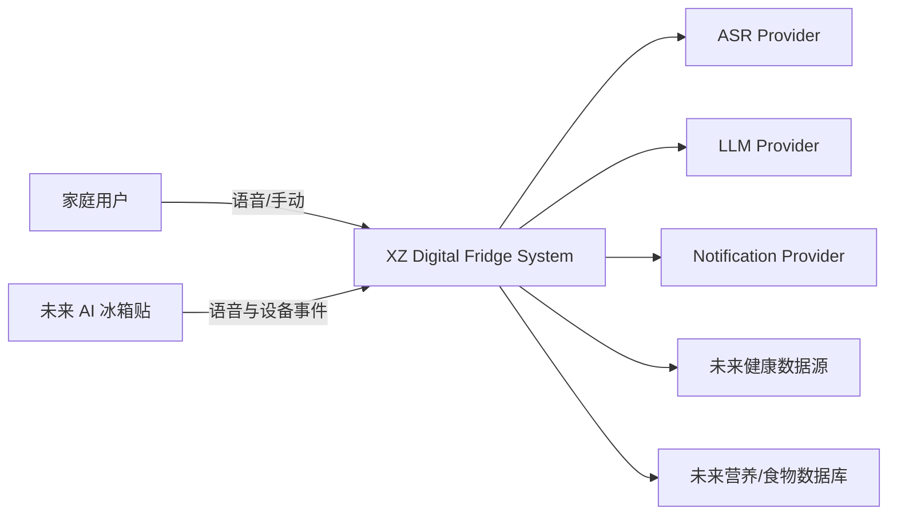
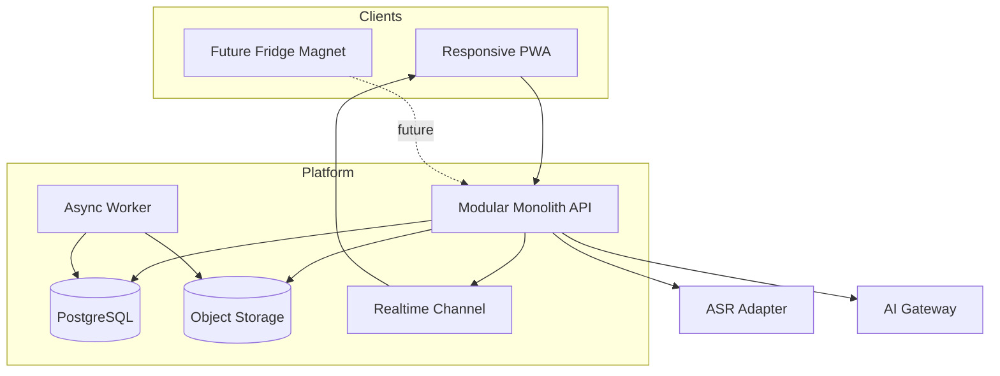
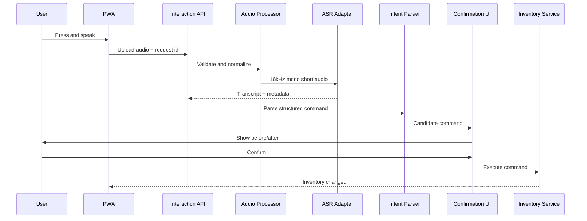
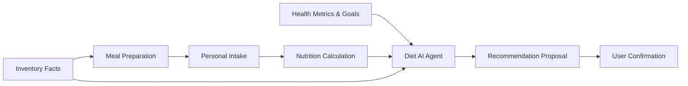

# XZ（鲜知）系统架构设计文档

| 字段     | 内容                                                |
| -------- | --------------------------------------------------- |
| 版本     | 1.0                                                 |
| 状态     | Proposed                                            |
| 架构模式 | Modular Monolith                                    |
| 当前部署 | PWA + API + Worker + PostgreSQL                     |
| 未来扩展 | AI 冰箱贴、Meal/Intake、Nutrition、Health、AI Agent |

## 1. 架构问题与约束

XZ 需要同时处理三类时间尺度不同的问题：

1. **现在**：以最少复杂度交付可用的软件 MVP；
2. **下一阶段**：接入冰箱贴硬件而不重写库存系统；
3. **未来**：把库存事实演进成个人摄入、营养、健康指标和 AI 建议。

主要约束：

- 早期团队规模小，不能维护大量服务；
- 业务边界仍在验证，不适合微服务；
- 语音和 AI 输出不确定，不能直接成为业务事实；
- 家庭数据、健康数据和原始音频具有隐私风险；
- 多终端和未来硬件可能重复提交请求；
- 营养与健康功能需要更高的数据可信度和可解释性。

## 2. 架构选择

### 2.1 候选方案

| 方案                | 优点                         | 缺点                                 | 结论                    |
| ------------------- | ---------------------------- | ------------------------------------ | ----------------------- |
| Supabase 客户端直连 | 快、低运维                   | 业务规则分散，未来硬件接入困难       | 不作为核心架构          |
| 模块化单体          | 简单事务、边界清晰、未来可拆 | 需要一层 API 和模块治理              | 采用                    |
| 微服务              | 独立部署和扩缩容             | 早期复杂度、分布式一致性、运维成本高 | 暂不采用                |
| 完整事件驱动        | 松耦合                       | 调试、消息一致性和基础设施复杂       | 仅采用领域事件 + Outbox |

### 2.2 决策

采用一个代码仓库、一个主要 API 部署单元、一个 PostgreSQL 数据库。内部按领域模块划分，非关键异步工作由 Worker 处理。

## 3. 架构原则

1. Domain First：先定义业务事实，再选择框架。
2. One Source of Truth：数据库是库存事实唯一来源。
3. Commands for Writes：所有写操作通过显式命令。
4. AI as Assistant：AI 产生候选和建议，不直接改事实。
5. Module Ownership：一个模块拥有自己的表和写逻辑。
6. Confirm Uncertainty：不确定输入进入确认流程。
7. Reversible Decisions：外部供应商、ASR、LLM、通知都通过 Adapter。
8. Simple Before Scalable：不为未发生的规模提前引入分布式系统。
9. Audit by Default：所有敏感写操作可追踪、可撤销。
10. Facts, Calculations, Inferences：用户事实、系统计算、AI 推断分层保存。

## 4. C4 Level 1：系统上下文



## 5. C4 Level 2：容器



## 6. 推荐技术结构

技术版本应在实施时锁定，不在架构文档中依赖“最新版本”。

- 前端：TypeScript、React/Next.js 响应式 PWA；
- 后端：TypeScript 模块化单体，可采用 NestJS 或等价结构化框架；
- 数据：PostgreSQL，Supabase 可提供 Auth、Realtime、Storage；
- Contract：OpenAPI + JSON Schema；
- 异步：Transactional Outbox + PostgreSQL-backed Worker；
- 音频：浏览器 MediaRecorder，服务端 ffmpeg 预处理；
- AI：ASR Provider Adapter、LLM Provider Adapter、Prompt Registry；
- 可观测性：OpenTelemetry、结构化日志、错误追踪和指标；
- 部署：Web、API、Worker 独立进程，但属于同一系统版本。

## 7. 模块边界

### 7.1 Household & Identity

职责：家庭、成员、角色、授权、时区、语言和隐私同意。

拥有：

- households
- household_members
- member_roles
- consents

不负责：库存、营养或健康指标内容。

### 7.2 Food Knowledge

职责：标准食材、别名、单位、保质期规则、营养数据引用和过敏标签。

拥有：

- food_catalog
- food_aliases
- units
- shelf_life_rules
- nutrition_profiles

当前 MVP 只需要基础字段；营养值允许为空。

### 7.3 Inventory

职责：数字冰箱、区域、库存批次、交易流水、FEFO 和库存不变量。

拥有：

- refrigerators
- storage_zones
- inventory_lots
- inventory_transactions

关键不变量：

- remaining_quantity >= 0；
- 交易与余额在同一事务内提交；
- 同一 idempotency key 不得重复执行；
- 删除通过反向交易，不直接抹除历史。

### 7.4 Interaction

职责：语音和手动输入、语音任务状态、ASR 结果、意图解析、确认和来源渠道。

拥有：

- interaction_sessions
- voice_jobs
- audio_assets
- asr_results
- intent_results
- confirmations

不负责直接修改库存。

### 7.5 Realtime & Notification

职责：家庭频道、实时事件投递、临期提醒、消息偏好和投递结果。

拥有：

- notification_rules
- notification_deliveries
- realtime_delivery_log

### 7.6 Device

职责：未来冰箱贴身份、凭证、状态、固件版本和命令。

MVP：只定义表和 API Contract，不部署 MQTT。

### 7.7 Meal & Intake

职责：未来菜品、食材用量、份量、成员摄入和营养快照。

必须与库存分离：库存减少不等于个人摄入。

### 7.8 Health

职责：未来健康档案、指标、目标、数据来源、授权与删除。

禁止由 AI 直接写入用户健康事实。

### 7.9 AI Agent & Insight

职责：受控 Tool 调用、计划、建议、周报、证据引用、Prompt 和模型版本。

AI Agent 默认只读；任何写操作产生 Proposal，由用户确认后调用领域命令。

## 8. 依赖方向

```text
UI / Device Adapters
        ↓
Application Services
        ↓
Domain Model
        ↓
Repository Ports
        ↓
Infrastructure Adapters
```

禁止：

- Domain 依赖 Web 框架、ORM、供应商 SDK；
- Inventory 直接写 Health 表；
- AI Prompt 承载业务规则；
- React 组件直接执行库存 SQL；
- ORM Hook 隐式触发跨模块业务。

## 9. 统一命令模型

所有入口转换成统一 Envelope：

```json
{
  "command_id": "cmd_01J...",
  "command_type": "CONSUME_INVENTORY",
  "schema_version": "1.0",
  "household_id": "hh_123",
  "actor_member_id": "member_456",
  "source": {
    "channel": "MOBILE_VOICE",
    "device_id": null,
    "interaction_id": "int_789"
  },
  "idempotency_key": "client-generated-key",
  "payload": {},
  "requested_at": "2026-07-21T03:00:00Z"
}
```

命令处理链：

```text
Authenticate
-> Authorize household access
-> Validate schema
-> Check idempotency
-> Validate domain rules
-> Execute transaction
-> Write outbox events
-> Return result
```

## 10. 语音流水线



### 10.1 音频规则

- 检测真实媒体类型，不信任文件扩展名；
- 最大 15 秒；
- 转换为 16kHz、单声道；
- 检测静音、削波、过低音量；
- 原始音频默认 24 小时删除；
- 生产日志不记录音频和完整未脱敏文本；
- 低质量音频不静默执行。

### 10.2 解析规则

ASR 文本 -> Normalizer -> LLM/Parser -> JSON Schema -> Food Alias Mapper -> Unit Normalizer -> Domain Validation。

LLM 不能直接调用 Repository。

## 11. 实时同步

### 11.1 一致性模型

- 核心库存写入：强一致事务；
- 多端 UI：最终一致，目标 1 秒内；
- 提醒、统计、AI 周报：异步最终一致。

### 11.2 事件

```text
InventoryLotCreated
InventoryConsumed
InventoryDiscarded
InventoryCorrected
InventoryTransactionReversed
ExpiryStatusChanged
VoiceCommandConfirmed
```

API 在事务中写业务表和 outbox。Worker 读取 outbox 后：

- 发布 Realtime；
- 更新统计；
- 生成提醒；
- 未来触发营养与 AI 分析。

## 12. Transactional Outbox

```text
outbox_events
- id
- event_type
- aggregate_type
- aggregate_id
- payload_json
- schema_version
- occurred_at
- available_at
- processed_at
- attempt_count
- last_error
```

要求：

- 与领域事务同库同事务；
- 消费者幂等；
- 失败重试，超过阈值进入 dead-letter 状态；
- 事件 Schema 版本化；
- 不把敏感原始音频放入 payload。

## 13. 未来健康扩展架构



### 13.1 四层事实

1. Inventory Fact：家庭库存变化；
2. Meal Fact：食材组成和产出份量；
3. Intake Fact：成员实际摄入；
4. Health Fact：测量指标与目标。

AI Insight 单独存储，带 evidence、confidence、model_version 和 limitations。

### 13.2 营养计算

每次计算保存 Nutrient Snapshot：

- 输入食材和份量；
- 数据源与版本；
- 单位换算版本；
- 计算时间；
- 用户确认值与估算值；
- 结果和置信度。

## 14. AI Agent 架构

```text
Agent Orchestrator
  ├─ InventoryReadTool
  ├─ ExpiryReadTool
  ├─ IntakeReadTool
  ├─ HealthGoalReadTool
  ├─ NutritionCalculateTool
  ├─ RecipeCandidateTool
  └─ ProposalCreateTool
```

规则：

- Tool 有明确输入输出 Schema；
- Agent 无数据库凭证；
- 写操作只能创建 Proposal；
- Proposal 经规则验证和用户确认后转成 Command；
- Prompt、模型和 Tool 版本必须记录；
- 回答必须引用使用的数据时间范围；
- 健康建议显示“非医疗诊断”边界。

## 15. 数据安全与隐私

### 15.1 多租户

- 所有家庭数据表包含 household_id 或可追溯到 household；
- API 每次请求验证 membership；
- PostgreSQL RLS 作为第二道防线；
- 管理员访问需要审计和最小权限。

### 15.2 数据分类

| 等级             | 示例                   | 处理要求                       |
| ---------------- | ---------------------- | ------------------------------ |
| Public           | 食材通用资料           | 可缓存                         |
| Internal         | 代码、配置、非敏感指标 | 受控访问                       |
| Confidential     | 家庭库存、语音文本     | 加密、审计、最小化日志         |
| Sensitive Health | 体检、血糖、血压       | 分离授权、更严格删除和访问控制 |

### 15.3 保留策略

- 原始语音：默认 24 小时；
- ASR 文本：用于审计，可由用户删除；
- 健康原始文件：未来按明确授权和政策；
- 日志：不保存完整敏感内容；
- 审计：保存必要元数据和哈希，不保存原始音频。

## 16. 可靠性与失败模式

| 失败               | 处理                                          |
| ------------------ | --------------------------------------------- |
| ASR 超时           | 一次重试，必要时备用 Provider；不执行写操作。 |
| LLM 非法 JSON      | Schema repair 一次，仍失败转人工确认。        |
| 网络重复提交       | idempotency key 返回原执行结果。              |
| 库存不足           | 拒绝命令，提供可修正候选。                    |
| Realtime 断开      | 客户端重连后重新拉取 authoritative snapshot。 |
| Outbox 失败        | 指数退避，dead-letter 和告警。                |
| 外部 Provider 故障 | 降级为手动操作，核心库存仍可用。              |
| 健康数据缺失       | 不生成精确健康结论，明确数据不足。            |

## 17. 可观测性

### 17.1 指标

- voice_job_duration_ms by stage；
- asr_success_rate；
- command_confirmation_rate；
- command_correction_rate；
- inventory_command_failure_rate；
- duplicate_command_blocked_total；
- realtime_delivery_latency_ms；
- outbox_backlog；
- provider_cost by feature；
- household_weekly_active_operations。

### 17.2 Trace

使用 correlation_id 贯穿：

```text
interaction_id -> voice_job_id -> command_id -> transaction_id -> event_id
```

### 17.3 日志

日志记录 ID、阶段、耗时、错误码和脱敏摘要，不记录原始音频、健康指标全文和密钥。

## 18. 部署拓扑

### MVP

```text
CDN/Edge
  -> PWA
API Runtime
  -> PostgreSQL/Supabase
  -> Object Storage
Worker Runtime
  -> Outbox polling / reminder jobs
External
  -> ASR / LLM / notification
```

环境：local、test、staging、production。每个环境使用独立数据库、存储和密钥。

## 19. 演进策略

### Phase 1：Software MVP

实现 Interaction、Inventory、Household、Food Knowledge 基础、Realtime。

### Phase 2：Hardware Pilot

增加 Device Adapter、设备凭证、HTTPS 音频上传、MQTT 状态与命令。核心业务不变。

### Phase 3：Meal & Intake

增加菜品、份量、个人摄入和营养快照。

### Phase 4：Health & Agent

增加健康数据适配、目标、受控 AI Agent、周报和个性化建议。

### 拆分服务的触发条件

只有出现以下实际问题才考虑拆分：

- 某模块需要独立高倍扩容；
- 发布节奏由不同团队独立负责；
- 数据隔离或合规要求必须物理分离；
- 单体部署已成为明确瓶颈并有测量证据。

## 20. 架构验收检查

- 模块所有权清晰；
- 所有写操作有命令和幂等；
- LLM 无直接写库路径；
- 库存和个人摄入模型分离；
- 数据隔离有 API 与 RLS 双层控制；
- 事件与 API 有版本；
- 外部供应商可替换；
- 失败时可降级到手动库存；
- 当前 MVP 不依赖未来硬件或健康功能上线。
